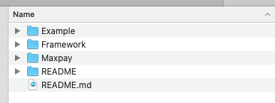
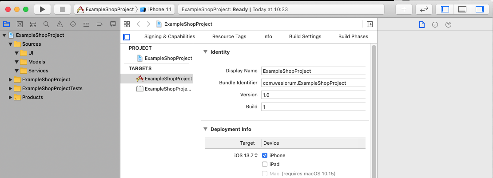
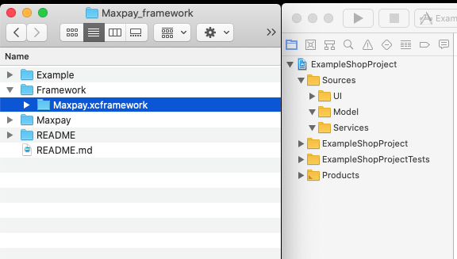
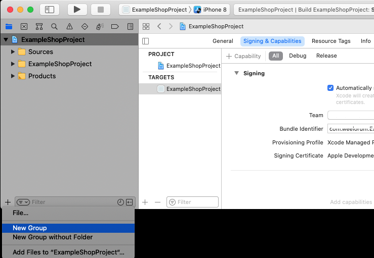
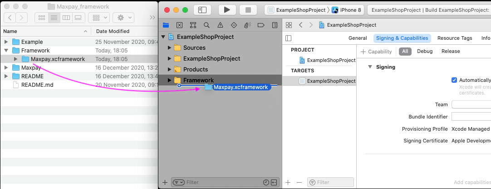
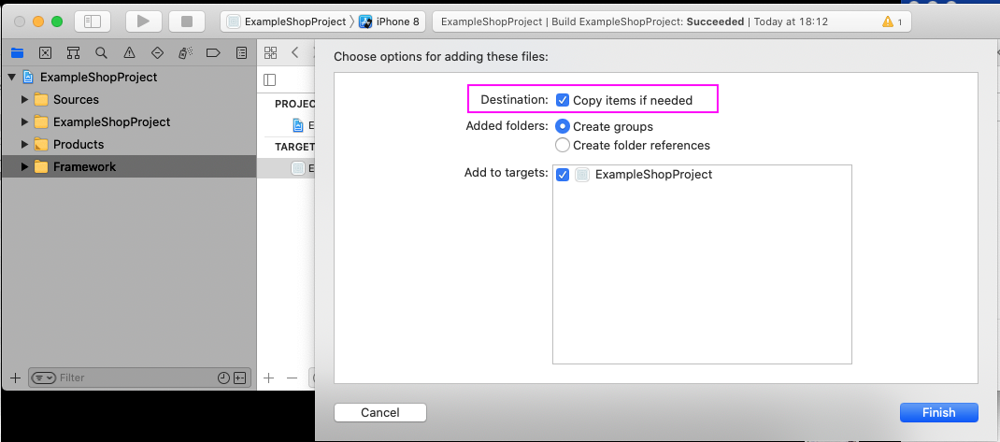
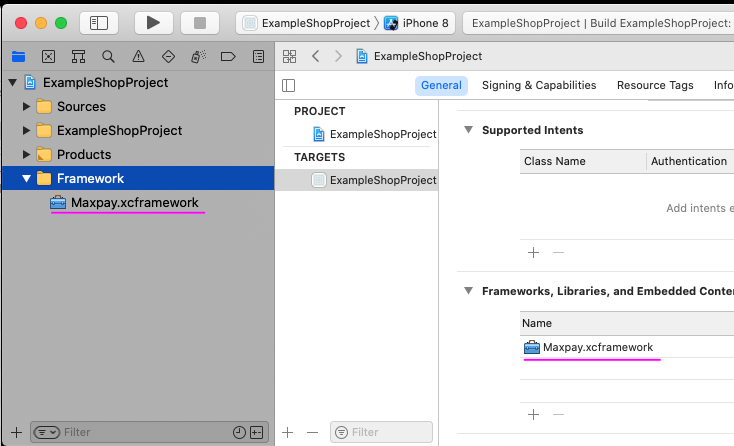
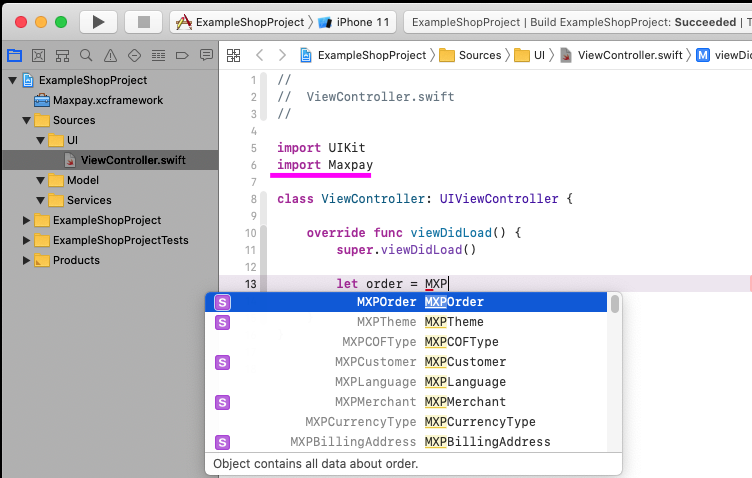

# Maxpay Payment iOS SDK

The Maxpay Payment iOS SDK makes it quick and easy to build a payment screen in your iOS app. We provide customizable MXPPaymentViewController that can be used out-of-the-box.

## Content
* [Requirements](#requirements)
* [Installation](#installation)
* [Integration prebuilt UI](#integration-prebuilt-ui)

## Requirements
ios10, Xcode11, Swift 4.

## Installation
### 1. Clone or download repository.

### 2. Open downloaded project, you should see folders with example, framework binary and source files.

### 3. Create or open Xcode iOS project which will use framework.

### 4. Select binary file.

### 5. In Xcode project create new group, name it "Frameworks" for example.

### 5. Drag and drom MaxpayPaymentSdk.frameworks to your project. Do not forget set checkmark to copy files.

### 6. Now import MaxpayPaymentSdk in source file and you will get access to all public objects from framework.

## Integration prebuilt UI
[How to use prebuilt UI see here](README/INTEGRATION.md).
