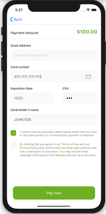
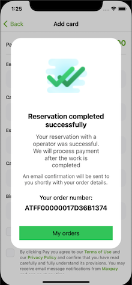
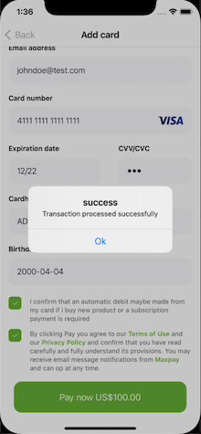
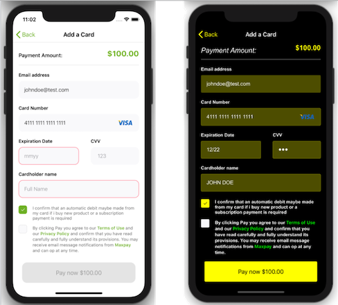

# Basic Integration

## Accept cards with the iOS SDK's prebuilt UI

Use this integration if you want a prebuilt UI that:

* accept credit cards
* support limited customization of fonts and colors
* display full-screen view controller to collect payment details and  billing address (optional).
* localized texts for the current device locale

## 1 Set up Maxpay

First of all [register](https://my.maxpay.com/#/signup) on site [Maxpay](https://maxpay.com/) and get merchant login and password.

## 2 Prepare data

In your application create all necessary forms and request to collect all data about merchant, customer and order.
On the basis of the information obtained create **PAYInitInfo**, **PAYPaymentInfo**.
  
### 2.1 Set up an PAYTheme

**PAYTheme** objects can be used to visually style Maxpay-provided UI. See [Customize the UI](#markdown-header-9-customize-the-ui) for more information.

### 2.2 Choose which form fields needed

With **PAYAvailableFields** object you can show or hide specific input fields on payment form. For example, shipping address may not match with billing address. If your bank use address validation system your payment request may be declined. To avoid this situation, set up ** showBillingAddressLayout** as `true` and fill this data personally.

| Property                  | Type      | Description                                    | Note     |
|---------------------------|-----------|------------------------------------------------|----------|
| showBillingAddressLayout  | Bool      | Show/hide customer's address                   | required |
| showNameField             | Bool      | Show/hide customer's first name and last name  | required |
| showPhone                 | Bool      | Show/hide customer's phone                     | required |
| showAddressField          | Bool      | Show/hide customer's address                   | required |
| showCityField             | Bool      | Show/hide customer's city                      | required |
| showZipField              | Bool      | Show/hide customer's zip                       | required |
| showCountryField          | Bool      | Show/hide customer's country                   | required |
| showBirthdayField         | Bool      | Show/hide customer's date of birth             | required |

### 2.2 Prepare initial information

**PAYInitInfo** provides some information to setup view controller and network requests.

| Property            | Type                 | Description                                | Note     |
|---------------------|----------------------|--------------------------------------------|----------|
| apiVersion          | Int                  | Maxpay API version                         | required |
| publicKey           | String               | Merchant public key                        | required |
| theme               | PAYTheme             | Color theme for controller                 | required |
| fieldsToShow        | PAYAvailableFields   | Type of authorization (only one type)      | required |
| isProduction        | Bool                 | Switch between test/production environment | optional |

### 2.3 Prepare payment information

**PAYPaymentInfo** provides information about customer.

| Property            | Type               | Description                                                  | Note     |
|---------------------|--------------------|--------------------------------------------------------------|----------|
| transactionType     | PAYTransactionType | Type of the transaction                                      | required |
| transactionUniqueID | String             | Unique transaction Id                                        | required |
| amount              | Float              | Amount of the transaction                                    | required |
| firstName           | String             | The first name of the customer                               | required |
| lastName            | String             | The last name of the customer                                | required |
| address             | String             | Customer's address                                           | optional |
| city                | String             | Customer's city                                              | optional |
| state               | String             | Customer's state                                             | optional |
| zip                 | String             | Customer's zip code                                          | optional |
| country             | String             | Customer's country, ISO 3166-1, alpha-3                      | required |
| phone               | String             | Customer's phone number.                                     | optional |
| email               | String             | Customer's email address                                     | required |
| ip                  | String             | Customer's IP address. Not all acquirers support IPv6 format | required |
| address             | String             | Customer's billing address                                   | required |
| auth3DRedirect      | String             | Redirection for AUTH3D transaction type                      | optional |
| sale3DCallback      | String             | Callback for SALE3D transaction type                         | optional |
| sale3DRedirect      | String             | Redirections for SALE3D transaction type                     | optional |
| currency            | String             | Currency in ISO 4217                                         | required |
| birthday            | String             | Date of birth of the customer                                | optional |

Additional sutype for **PAYPaymentInfo**:

**PAYTransactionType** is transaction types supported by Maxpay.

| State  |
|--------|
| auth   |
| auth3d |
| sale   |
| sale3d |

### 2.4 Prepare signature calculation
Signature is encrypted string which contains all information about merchant, customer and order. Using transaction you can be shure that your data do not leave SDK in open format. To calculate signature, read this [manual](https://maxpay.com/docs/#maxpay-js). To create signature you need to user private key. We highly recommend do this calculation on server side. For this purpose, you should create block with two input parameters: **PAYSignatureInfo** (contains all information to create signature exept private key and completion block. Completion block has encrypted string as input parameter. 

Signature calculation block:
**(PAYSignatureInfo, @escaping (String) ->()) -> ()**

**PAYSignatureInfo** provide information to create signature, actually it contains some fields from **PAYInitInfo** and **PAYPaymentInfo**.

	init(
		initInfo: PAYInitInfo,
		paymentInfo: PAYPaymentInfo
	)

| Property            | Type    | Description                              | Note     |
|---------------------|---------|------------------------------------------|----------|
| apiVersion          | Int     | Maxpay API version                       | required |
| authType            | String  | Type of authorization (only one type)    | required |
| transactionUniqueID | String  | Unique transaction Id                    | required |
| transactionType     | String  | Type of the transaction                  | required |
| amount              | String  | Amount of the transaction                | required |
| currency            | String  | Currency in ISO 4217                     | required |
| firstName           | String  | The first name of the customer           | required |
| lastName            | String  | The last name of the customer            | required |
| address             | String  | Customer's address                       | optional |
| city                | String  | Customer's city                          | optional |
| state               | String  | Customer's state                         | optional |
| zip                 | String  | Customer's zip code                      | optional |
| country             | String  | Customer's country, ISO 3166-1, alpha-3  | required |
| phone               | String  | Customer's phone number                  | optional |
| email               | String  | Customer's email address                 | required |
| ip                  | String  | Customer's IP address.                   | required |
| callbackURL         | String  | Callback for SALE3D transaction type.    | optional |
| redirectURL         | String  | Redirection for SALE3D transaction type  | optional |
| birthday            | String  | Date of birth of the customer            | optional |

### 2.5 Prepare payment procedure result handling

Payment procedure may finished with success of failure by different reason. To handle response from Maxpay you should create completion function or block.
Signature completion block:
**(Result<PAYTransactionResponse, Error>) -> ()**

**PAYTransactionResponse** provide information about transaction, its number, timestamp, status, error message e.t.c.

| Property            | Type    | Description                                                  | Note     |
|---------------------|---------|--------------------------------------------------------------|----------|
| apiVersion          | Int     | Maxpay API version                                           | required |
| merchantAcc         | String  | Merchant account                                             | required |
| sessionID           | String  | Id of the session                                            | required |
| transactionUniqueID | String  | Unique transaction Id                                        | required |
| token               | String  | Hashed value of card number, expiry date and cardholder name | required |
| reference           | String  | Reference of the transaction in Maxpay system                | required |
| timestamp           | String  | Timestamp of the transaction                                 | required |
| authCode            | String  | Authorization code                                           | required |
| status              | String  | Status of the transaction (success, decline, error)          | required |
| responseCode        | String  | Response code regarding the transaction result               | required |
| message             | String  | Response message regarding the transaction result            | optional |

### 2.6 Prepare callbacks

**PAYCallback** is just a wrapper for two previously described functions.

| Property             | Type                                              | Description                  | Note     |
|----------------------|---------------------------------------------------|------------------------------|----------|
| signagureCalculation | (PAYSignatureInfo, (String) -> Void) -> Void      | Signature calculation block  | required |
| completion           | (Result<PAYTransactionResponse, Error>) -> Void   | Payment completion block     | required |

## 3 Set up an PAYPaymentViewController

**PAYPaymentViewController** contains a credit card entry form that the user can fill out. On submission, it will use the Maxpay API to convert the user’s card details to a payment request.
Initialize this class with **PAYInitInfo**, **PAYPaymentInfo** objects and **PAYCallback**.

	init(
		initInfo: PAYInitInfo, 
		paymentInfo: PAYPaymentInfo, 
		callbacks: PAYCallback
	)

Also on this screen customer can change name, address, date of birth or email (if **PAYAvailableFields** was configured properly).

## 4 Completion the payment

After the payment has been processed it will be called completion handler. This handler takes **Result<PAYTransactionResponse, Error>** as input parameter. Usually if you have some technical problem (bad network connection for example) you can received standard Error. You can use code and description from Error to handle this situation and warn user about problem.
If you have no problem with connection and hardware than you will received response **PAYTransactionResponse** from Maxpay server. 
There are two main cases, payment was successfully accepted or rejected by some reason. If payment accepted you will received unique number in 'reference' field.

Server success response example:

		{
		    "api_version": 1,
		    "merchant_account": "ZooShop",
		    "sessionid": "7c5dbf-2248-60894cf7-17942bb43d2-13b1",
		    "transaction_unique_id": "sale_request1620322239",
		    "token": "5f8ddae3-d290-4415-9818-68729d3202f3",
		    "reference": "ATFF00000094D1ED5D4B",
		    "timestamp": 1620322239,
		    "authcode": "",
		    "status": "success",
		    "code": 0,
		    "message": "Transaction processed successfully"
		}

Server failure response example:

		{
		    "api_version": 1,
		    "merchant_account": null,
		    "sessionid": "7c5dbf-2240-60894cf7-179461b17af-15c8",
		    "transaction_unique_id": null,
		    "token": null,
		    "reference": null,
		    "timestamp": 1620378851,
		    "authcode": null,
		    "status": "error",
		    "code": 1004,
		    "message": "Validation error in field(s) `amount` (Value must be greater or equals 0)"
		}

 
In the end of the payment process there are multiple ways to communication with user. You can store reference number in local or remote database, save in user history, create receipt and send to user email etc. You can redirect user on main screen to continue shopping or to profile screen with history of orders. 
In case you have received an error message there are also multiple options. You can try to describe problem to user using 'message' field, stay on payment screen and offer to user try to use another credit card or check and edit personal information. Or you can redirect him on technical support page.
In demo application we just show standard Alert with message from server and stay on payment screen. 

Received response **PAYTransactionResponse** contain all information to finish payment flow. Because completion closure creates on user side, in comletion body you will also have access to presenting controller or navigation controller, all variable and all services.

 

## 5 Test the integration

[Test data from Maxpay.](https://maxpay.com/docs/#test-mode)

## 6 Customize the UI

The appearance of the UI components is customizable by using the **PAYTheme** object. 

| Property                      | Type    | Description                                                           |
|-------------------------------|---------|-----------------------------------------------------------------------|
| backgroundColor               | UIColor | Background color of whole payment screen                              |
| errorColor                    | UIColor | Color to mark error                                                   |
| hyperlinkColor                | UIColor | Color to mark links to Maxpay Terms and Conditions and Privacy Policy |
| headerTitleColor              | UIColor | Amount header title color                                             |
| headerAmountColor             | UIColor | Amount color                                                          |
| headerSeparatorColor          | UIColor | Amount header separator color                                         |
| headerStandardTitleFont       | UIFont  | Header standard font (only for Amount header)                         |
| headerLargeTitleFont          | UIFont  | Header large font (only for Billing Address header)                   |
| fieldBackgroundColor          | UIColor | Input field background color                                          |
| fieldTitleColor               | UIColor | Intput field title text color                                         |
| fieldTextColor                | UIColor | Input field text color                                                |
| fieldPlaceholderColor         | UIColor | Input field placeholder color                                         |
| fieldTitleFont                | UIFont  | Input field title font                                                |
| fieldTextFont                 | UIFont  | Input field text font                                                 |
| fieldBackgroundCornerRadius   | CGFloat | Input field corner radius                                             |
| checkmarkColor                | UIColor | Checkmark color                                                       |
| checkboxCornerRadius          | CGFloat | Checkbox corner radius                                                |
| conditionsTextColor           | UIColor | Conditions text color                                                 |
| conditionsFont                | UIFont  | Conditions font                                                       |
| enabledButtonBackgroundColor  | UIColor | Color for unlocked Pay button                                         |
| enabledButtonTitleColor       | UIColor | Color for unlocked title Pay button                                   |
| disabledButtonBackgroundColor | UIColor | Color for locked Pay button                                           |
| disabledButtonTitleColor      | UIColor | Color for locked title Pay button                                     |
| buttonTitleFont               | UIFont  | Pay button title font                                                 |
| buttonCornerRadius            | CGFloat | Pay button corner radius                                              |

**Warning**: some of the checkmark colors takes from another properties 

checkbox selected color = enabledButtonBackgroundColor

checkbox deselected color = fieldBackgroundColor

checkbox error color = errorColor
